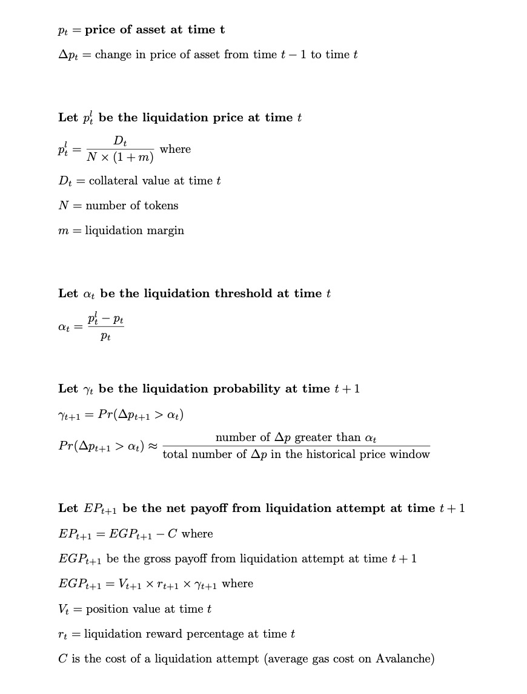

# Team Liquidatooooors 🏋
Team: Denham, James & Woo 
# Statistical Probabilistic Liquidation BOT Executor

We have built a liquidation bot for WOWSwap, that improves the current version in several ways while remaining lightweight for many users to run.

Our predictive algorithm results in the liquidation transaction happening an entire block before the current liquidation bot while remaining profitable.   

Our bot uses a probabilistic liquidation predictor that dynamically examines recent prices' volatility and calculates the probability that the next price will cross the liquidation price. The bot uses this probability to compute an expected reward for any liquidation transaction. To calculate the expected value, the system considers the payoff size using the position size and max reward and considers all costs (gas fees, etc.). If the liquidation transaction's expected value (i.e. profitability) exceeds a threshold, the system submits a transaction.

Our bot is customisable per market so that users can adjust their profitability preferences. Customisability prevents a speed race where all bots fire transactions simultaneously, so the fastest (and most expensive) hardware would win. Instead, users can adjust the parameters to find an edge.

 Our system benefits the broader WOWSwap system as our bot is more reactive to larger positions as these pose a greater risk to liquidity providers if they are slow to liquidate.

### Probability Math

###  files of interest
`AggressiveLiquidator.js`
`config.js` - Allows for customizing the parameters of the strategy to cater to liquidatoooors
`PositionMonitors.ts` 
`AmmPriceData.ts`

# Liquidation BOT Base

Liquidates or Terminates positions when conditions for liquidation/termination are met. 

Liquidation and Termination are transactions, and require some amount of native token in wallet (see PRIVATE_KEY in Configuration).

## Deploy

### Heroku
Requires at least dyno "Standard 2X".

### Digital Ocean
Recommended plan is Basic with one "2 GB RAM | 1 vCPU".

### Manual (Docker)

1. Install `docker` and `docker-compose` packages
2. Create directory for bot files
3. Copy [docker-compose.example.yml](https://raw.githubusercontent.com/wowswap-io/liquidation-bot/master/docker-compose.example.yml) to `docker-compose.yml`
4. Copy [.env.example](https://raw.githubusercontent.com/wowswap-io/liquidation-bot/master/.env.example) to `.env`
5. Specify liquidator PRIVATE_KEY in `.env`
6. Specify CHAIN_ID and other configuration variables in `docker-compose.yml`
7. Run `docker-compose up -d`

### Configuration

| Environment Variable | Required | Description                                                                                           | Default value |
|----------------------|----------|-------------------------------------------------------------------------------------------------------|---------------|
| PRIVATE_KEY          | Yes      | Hex encoded private key of liquidator wallet. Example: 4e49...814f. Should be 64 characters long      | -             |
| CHAIN_ID             | No       | Decimal chain id. List of supported chain ids is in .deploy folder. Default is Binance                | 56            |
| PROVIDER_URL         | No       | URL of a RPC provider for blockchain. Defaults are in .deploy files. Supports https and wss endpoints |               |
